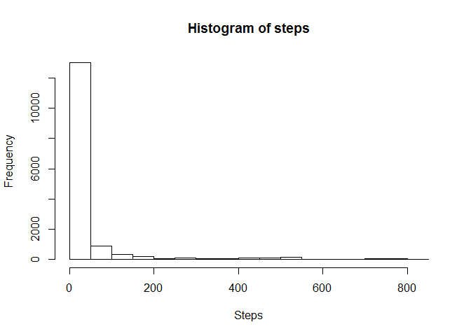
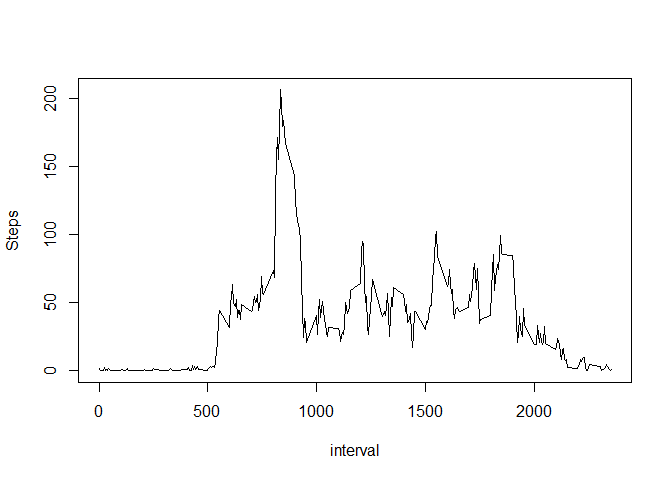
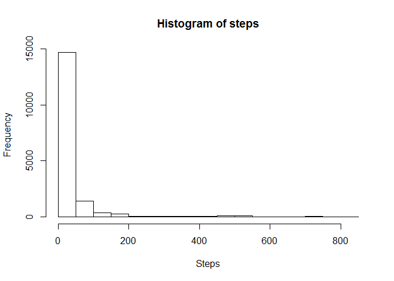
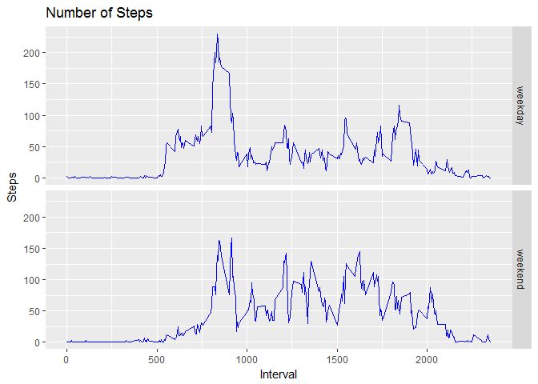

R Markdown
----------

Loading and preprocessing the data
----------------------------------

    unzip('activity.zip')
    df <- read.csv('activity.csv')

What is mean total number of steps taken per day?
-------------------------------------------------

    hist(df$steps, main = "Histogram of steps", xlab = 'Steps')

    print(paste('Mean of Steps:',mean(df$steps, na.rm = TRUE)))

    ## [1] "Mean of Steps: 37.3825995807128"

    print(paste('Median of Steps:',median(df$steps, na.rm = TRUE)))

    ## [1] "Median of Steps: 0"

What is the average daily activity pattern?
-------------------------------------------

    df_int <-
      df %>% group_by(interval) %>% 
      filter(!is.na(steps)) %>% 
      summarise(Steps = mean(steps))

    ## Warning: package 'bindrcpp' was built under R version 3.3.3

    plot(df_int, type = "l")

    print(paste('Interval with the most amount of steps is:',which.max(df_int$Steps)))

    ## [1] "Interval with the most amount of steps is: 104"

Imputing missing values
-----------------------

    print(paste("Total number of missing values is:", sum(is.na(df))))

    ## [1] "Total number of missing values is: 2304"

    df_clean <-
      df %>% 
      group_by(interval) %>% 
      mutate(steps = ifelse(is.na(steps), mean(steps, na.rm=TRUE), steps))

    hist(df_clean$steps, main = "Histogram of steps", xlab = 'Steps')

    print(paste('Mean of Steps:',mean(df_clean$steps, na.rm = TRUE)))

    ## [1] "Mean of Steps: 37.3825995807128"

    print(paste('Median of Steps:',median(df_clean$steps, na.rm = TRUE)))

    ## [1] "Median of Steps: 0"

Are there differences in activity patterns between weekdays and weekends?
-------------------------------------------------------------------------

    df_transform <-
      df_clean %>% 
      mutate(DayType = ifelse(weekdays(as.Date(date), abbreviate = TRUE) %in% c('Pn','Wt','Śr','Cz','Pt'), 'weekday','weekend')) %>% 
      group_by(DayType, interval) %>% 
      summarise(Steps = mean(steps))

    ggplot(df_transform, aes(x = interval, y = Steps)) + 
      facet_grid(DayType~ .) +
      geom_line(col = 'blue') +
      labs(y = "Steps",
           x = "Interval",
           title = "Number of Steps")

